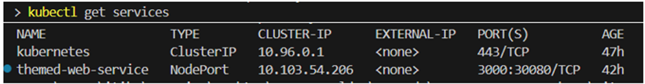

# SIT323/SIT737 – Task 6.2C: Interacting with Kubernetes

### Student Name: Inwang Ubong Marshal
### Student ID: 222093271
### Repository: https://github.com/222093271/sit323-sit737-2025-prac6c.git


## 📝 Overview

This task is a continuation of repository `sit323-sit737-2025-prac6p` (Task 6.1P), where the Node.js application were deployed using Kubernetes. In Task 6.1P, the student deployed a containerized Node.js web application into a local Kubernetes cluster using Docker and Kubernetes YAML configuration files. Task 6.2C takes the project one step further — by interacting directly with the running Kubernetes cluster and performing a controlled update of the application.

The aim of this task is to help the student explore **how Kubernetes clusters can be interacted with using the command-line interface (kubectl)** and how developers can **update running applications in a seamless, structured way**.

This task is divided into two main parts:

- **Part I**: It verifies that the application is running correctly using `kubectl get pods` and `kubectl get services`. Then, the application is accessed locally by forwarding a port from the Kubernetes pod to the host machine using `kubectl port-forward`.

- **Part II**: It updates the application content (frontend and backend), builds a new Docker image tagged with a version, and updates the Kubernetes deployment to use the new image. This step demonstrates how Kubernetes can handle rolling updates and how developers can deploy new versions of applications without downtime.

This documentation also includes all the necessary steps performed in **Task 6.1P**, since it forms the foundation of this interaction. Together, Task 6.1P and Task 6.2C reflect a complete end-to-end lifecycle: **develop → containerize → deploy → interact → update** — aligned with real-world DevOps workflows.


## 🛠️ Tools and Technologies Used

- **Node.js** – JavaScript runtime used to build the web application.
- **Express.js** – Backend framework used for serving the static web content.
- **Docker** – Containerization platform to package and run the application.
- **Docker Compose** – Used in Task 6.1P for simplified local development and health checks.
- **Kubernetes** – Container orchestration platform for deploying and managing the application.
- **kubectl** – Command-line tool to interact with the Kubernetes cluster.
- **Visual Studio Code (VS Code)** – Code editor used for development and configuration.
- **Git & GitHub** – Version control and cloud repository for managing and submitting the project.
- **Docker Desktop** – Provides local Kubernetes cluster and Docker engine for container operations.


## 🧱 Task 6.1P Summary and Foundation Setup

Before starting Task 6.2C, the foundation for the application was built in **Task 6.1P**. In that task, the student developed a simple **Node.js + Express.js** application that served static content from a `public/` folder.

The application was containerized using Docker. A `Dockerfile` was created to define the build process, including copying files, installing dependencies, and exposing port 3000. A `docker-compose.yml` file was also added to help run the application locally with automated health checks.

Once the Docker image was verified to work locally, the student then created the necessary **Kubernetes configuration files**:
- `deployment.yaml` – Described how the application should be deployed (number of pods, container settings, image name).
- `service.yaml` – Exposed the application using a Kubernetes `NodePort` service to make it accessible via the browser.

The application was deployed to a **local Kubernetes cluster** enabled via Docker Desktop, and was successfully accessed at `http://localhost:30080`.

This working setup from Task 6.1P was used as the **starting point** for Task 6.2C. The existing codebase was cloned and reused to interact further with Kubernetes and perform a versioned application update.


## Step 1: Setting Up Your Project

To begin Task 6.2C, we reused the completed project from Task 6.1P. Rather than starting from scratch, the existing codebase was **cloned into a new folder** and version-controlled separately to avoid modifying the original repository.

This ensures a clean structure while allowing changes specific to Task 6.2C.

### 1.1 Clone Task 6.1P Repo Locally

The following command was used to clone the 6.1P repo into a new folder named `sit323-sit737-2025-prac6c`:

```
git clone https://github.com/222093271/sit323-sit737-2025-prac6p.git sit323-sit737-2025-prac6c 
cd sit323-sit737-2025-prac6c
```


Open the folder in VS Code:
```
code .
```

### 1.2 Initialise a Fresh Git Repo for 6.2C

To prepare the new folder for Task 6.2C and prevent pushing to the old repository, Git was reset and reinitialised:

```
Remove-Item -Recurse -Force .git         # (deletes Git history)
git init
git add .
git commit -m "Initial commit for Task 6.2C"
```

With this, the project was successfully set up and ready to begin Task 6.2C, building upon the solid foundation from Task 6.1P.


## Step 2: Verifying the Kubernetes Environment

Before interacting with or updating the deployed application, it is essential to ensure that the local Kubernetes environment is running properly. Docker Desktop is used in this project to provide a single-node Kubernetes cluster for local development.

### Enabling Kubernetes in Docker Desktop

1. Open **Docker Desktop**
2. Navigate to:  
   `Settings` → `Kubernetes`
3. Ensure the **"Enable Kubernetes"** checkbox is ticked.
4. Wait until the status changes to: **Kubernetes is running**

It may take a minute or two for Kubernetes to start fully.

### Testing the Kubernetes Cluster

Open a terminal inside **VS Code** and run the following commands:

```
kubectl get pods
kubectl get services
```
 



This verification step ensures that Kubernetes is ready to handle new deployments, port-forwarding, and application updates as required in Task 6.2C.


## Step 3: Interacting with the Deployed Application (Part I)

Once the Kubernetes environment was verified and the deployment was successfully applied, the next step involved **interacting with the application** that was running inside the Kubernetes cluster.

Kubernetes pods do not expose their applications to the host machine by default. Therefore, in order to test and access the deployed web application in a browser, the student used the `kubectl port-forward` command.

### 3.1 Verifying the Running Pods

To identify which pods were running, the following command was executed:

```
kubectl get pods
```


This command listed all active pods within the default namespace. The output showed the pods created from the Kubernetes deployment (themed-web-deployment) and an earlier pod from Task 6.1P:
 

### 3.2 Forwarding Local Port to Pod Port
Since the application inside the container listens on port 3000, and the host machine cannot access container ports directly, a port-forwarding command was used to expose it temporarily:

```
kubectl port-forward pod/themed-web-deployment-6d58d886-wgvhj 8080:3000
```

This command mapped local port 8080 to the pod's internal port 3000. Once active, the terminal confirmed that traffic was being routed:


### 3.3 Accessing the Application in the Browser

After forwarding was active, the application could be accessed using a web browser at: http://localhost:8080 

This allowed the student to test the deployed app directly, without needing an external IP or load balancer setup.


This step confirmed that the application was correctly deployed, running, and reachable using Kubernetes interaction commands.

 
## Step 4: Updating the Application (Part II)

After verifying that the original version of the application was successfully deployed and accessible, the next objective in Task 6.2C was to **modify the application content**, build a new Docker image with a version tag (`v2`), and then redeploy it using Kubernetes.

This step demonstrates a common DevOps workflow where an application is updated and pushed live without downtime or major changes in infrastructure.


### 4.1 Editing the Application Code

To visually reflect that an update has been made, both the frontend and the backend output were modified.

#### A. Update in `public/index.html` and `public/style.css`

The file `public/index.html` was updated to include a new heading that clearly shows this is **version 2 of the app**. In css file `public/style.css`, the colour of border and button was updated to different from earlier. 

```
<h1>Hello from Dockerized Web App – v2 🚀</h1>
```

This change allows users to instantly recognise the version of the app when opened in the browser.

#### B. Update in application.js

The console output (which is visible in the container logs) was also updated for versioning clarity:

```
console.log(`🌐 App v2 running at http://localhost:${port}`);
```

This message gets logged in the terminal or Docker container logs, making it easier to confirm that the updated version is running.

These code changes laid the groundwork for the next step: rebuilding the Docker image with a new version tag (v2) and updating the Kubernetes deployment to reflect this change.


## 🐳 Step 5: Building the Updated Docker Image (v2)

Once the application code had been updated to reflect **version 2 (v2)**, the next step was to build a new Docker image that packages this updated version. This updated image would then be used in the Kubernetes deployment.

This process mimics real-world CI/CD pipelines, where every code change is followed by a new build, version tagging, and deployment.

### 5.1 Rebuilding the Docker Image with a Version Tag

The Docker image was rebuilt using the same `Dockerfile` used in Task 6.1P, but this time the image was explicitly tagged as version **v2**. This helps distinguish it from previous builds and allows Kubernetes to pull the updated image without confusion.

The following command was used to build the Docker image:

```
docker build -t my-themed-web-app:v2 .
```


#### Tag the Image as latest

Although tagging the image as v2 is recommended for clarity and control, Docker images can also be tagged as latest so Kubernetes defaults to the most recent version:

```
docker tag my-themed-web-app:v2 my-themed-web-app:latest-version
```

This command doesn’t rebuild the image — it simply creates an additional tag (latest) pointing to the same image ID.

### 5.2 Confirming the Docker Image Was Created

To verify that the image was successfully created and tagged, the following command was used:

```
docker images
```

The expected output includes an entry like the following:


 
This confirms that the updated application has been successfully containerized and is ready to be deployed to the Kubernetes cluster. 
Tagging images by version (e.g., v2) is a best practice for deployment and rollback safety. It ensures that Kubernetes doesn’t reuse a cached or outdated image when applying new changes.

## ☸️ Step 6: Updating the Kubernetes Deployment

To deploy the updated version of the application, the `deployment.yaml` file was modified to reference the newly built Docker image tagged as `v2`. Specifically, the `image` field under the `containers` section was updated:

```
  containers:
        - name: themed-web
          image: my-themed-web-app:v2
          imagePullPolicy: Never
          ports:
            - containerPort: 3000
          resources:
            limits:
              memory: "128Mi"
              cpu: "500m"
            requests:
              memory: "64Mi"
              cpu: "250m"
```

The imagePullPolicy: Never ensures Kubernetes uses the locally built image instead of trying to pull it from an external registry, which is ideal for local development.

To apply the updated deployment, the following commands were used:

```
kubectl apply -f deployment.yaml
kubectl rollout status deployment themed-web-deployment
```


This triggers a rolling update where Kubernetes gracefully stops the old pods and starts new ones with the updated image (v2). The rollout status command confirms that the update completes successfully without downtime.


## Step 7: Verifying the Updated Application

After applying the updated deployment configuration with the `v2` image, the next step was to verify that the new version of the application was correctly running inside the Kubernetes cluster.

### 7.1 Get the New Pod Name

To begin, the following command was used to list all running pods:

```
kubectl get pods
```


The output confirmed that two new pods were created under the deployment themed-web-deployment, and both were in the Running state, indicating that the rollout of the updated image was successful.

### 7.2 Forward Local Port to Pod

To access the updated app, port forwarding was used again:

```
kubectl port-forward pod/themed-web-deployment-6d58d886-x9wts 8080:3000
```

This maps local port 8080 to the pod's container port 3000. Once running, the application could be accessed at: http://localhost:8080 


The image confirms that traffic was being forwarded successfully, allowing the user to access the updated UI and log output.

The updated web interface and container logs display version 2, proving that the app update and redeployment process using Kubernetes was successful.


## Docker Image Validation and Application Output

After updating the application to version 2 and deploying it via Kubernetes, a series of validations were performed to ensure the application was running as expected and the Docker image was correctly configured and secure. The following images provide visual proof of the successful outcome.

### 1. App v2 Displayed in Browser (Port 8080)


 
This screenshot shows the updated version of the web application running at `http://localhost:8080` after forwarding local traffic to the Kubernetes pod. The message clearly displays:
> **"Hello from Dockerized Web App – v2 🚀"**

This confirms that the version update was successful and that the deployed container is indeed running the newly modified `index.html`.

### 2. Docker Image Tags Showing v2 and latest-version


 

This screenshot captures the **Docker Desktop > Images** tab, listing all local Docker images. It shows:

- `my-themed-web-app:v2` — the newly built image from the updated app.
- `my-themed-web-app:latest-version` — an alternate tag pointing to the same image ID.
- A previous version (`v1`) for comparison.

This verifies version tracking and helps in managing updates between app versions.

### 3. Image Vulnerability Scan via Docker Scout


Using Docker Scout, the image `my-themed-web-app:latest-version` was scanned for vulnerabilities. The base image used is `node:23-bookworm-slim`, which significantly reduced the number of vulnerabilities compared to older base versions.

- All high-severity vulnerabilities were eliminated.
- Only low-severity CVEs remain, primarily from system-level dependencies that do not impact the app’s behavior.

This ensures the image is production-safe in controlled environments and reflects secure image-building practices.

> These images serve as visual proof that the application was successfully updated, secured, deployed, and accessed — fulfilling the objectives of both Task 6.1P and Task 6.2C.


## Step 8: Pushing to a New GitHub Repository

After completing the application updates, Docker rebuild, and Kubernetes redeployment, the final step was to publish the project to a new GitHub repository for submission and sharing.

### 8.1 Create a New GitHub Repository

A new GitHub repository named: `sit323-sit737-2025-prac6c`

> ⚠️ Important: No README, .gitignore, or license was added during creation. This ensures the local repository can be pushed without conflicts.


### 8.2 Connect Local Folder to GitHub Repo

To push the project, the local repository was connected to GitHub using the following commands:

```
git remote add origin https://github.com/222093271/sit323-sit737-2025-prac6c.git 
git branch -M main
git push -u origin main
```

*	`git remote add origin` connects the local folder to the GitHub repository.
*	`git branch -M main` sets the local branch name to main.
*	`git push -u origin main` pushes all project files to GitHub and sets up future tracking.

The complete project, including all updated code, YAML configs, and documentation, is now hosted and ready for assessment or collaboration.


## Conclusion and Learning

This project provided a hands-on, end-to-end experience in building, containerizing, deploying, and interacting with a cloud-native application using modern DevOps tools. Task 6.1P introduced the foundational concepts of containerization with Docker, where a simple Node.js and Express application was created, tested locally using Docker Compose, and deployed into a Kubernetes cluster. The experience of writing Dockerfiles, composing containers, and verifying container health helped in understanding how microservices operate in isolated environments.

In Task 6.2C, the learning advanced further by engaging directly with the Kubernetes ecosystem using `kubectl`. Students explored how to verify running pods and services, use port-forwarding to access internal applications, and perform seamless updates to the deployed application. Version-controlled image tagging (`v2`) and rolling updates through Kubernetes deployments demonstrated real-world continuous deployment workflows.

Additionally, exposure to Docker Scout for vulnerability scanning encouraged secure development practices and reinforced the importance of selecting lightweight and secure base images.

Overall, this task bridged the gap between development and deployment, emphasising automation, repeatability, and scalability—key principles in cloud-native application development. These practical steps simulate real industry workflows and equip students with the confidence to build and manage microservices in containerized environments.
